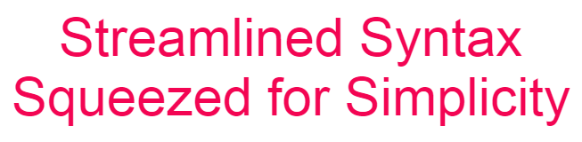

sQeeZ is a modern scripting language designed for users who prioritize simplicity, power, and flexibility in their coding projects. Its concise and efficient syntax enables developers to create clean, readable code that meets their specific needs. The language streamlines the development process, allowing users to implement complex functionalities with greater efficiency.

 

# 🔑 Key Components of sQeeZ

### 🔤 Lexer
The **Lexer** is the initial component of the sQeeZ engine, responsible for transforming raw input into a sequence of meaningful **Tokens**. These tokens serve as the basis for how our language is structured, enabling the parser to interpret syntax and semantics effectively. By understanding the input, the lexer ensures that sQeeZ maintains its simplicity and flexibility.

### 🛠️ Parser
The **Parser** builds on the Lexer's output to construct an **Abstract Syntax Tree (AST)**. This tree is fundamental to understanding the hierarchical structure of the code, laying the groundwork for efficient execution and manipulation of the code's logic.

### ⚡ Interpreter
The **Interpreter** is the key to making your code come alive! By executing the parsed AST, it makes sQeeZ a dynamic tool that can be used for both quick scripting tasks and complex applications. Get immediate feedback and powerful functionality at your fingertips!

### 🌐 Language Server
Our comprehensive **Language Server** optimizes your coding experience in IDEs like VSCode. With features such as syntax highlighting, auto-completion, and error checking, you'll have all the tools you need to code efficiently and effectively in sQeeZ.

---

Feel free to explore each component further to understand their roles and how they complement each other in the sQeeZ Scripting Language! 🔍

* 🔤 <a href="https://github.com/sqeez-scripting-language/lexer/">Lexer</a> 
* 🛠️ <a href="https://github.com/sqeez-scripting-language/parser/">Parser</a> 
* ⚡ <a href="https://github.com/sqeez-scripting-language/interpreter/">Interpreter</a> 
* 🌐 <a href="https://github.com/sqeez-scripting-language/language-server/">Language Server</a> 

 

# 📚 Documentation
Explore our comprehensive documentation to get started with sQeeZ! Whether you are new to the language or looking to gain a deeper understanding of its features, you will find valuable resources covering:

* 🚀 **Getting Started**: Learn how to set up your environment and write your first sQeeZ code.
* ✨ **Basic Functionality**: Discover the core features and capabilities of the language.
* 📝 **Syntax**: Understand the syntax rules that define how to structure your code effectively.
* 🔑 **Key Components**:
    * 🔤 **Lexer**: Learn how to utilize the lexer to break down input into tokens.
    * 🛠️ **Parser**: Understand how the parser constructs the Abstract Syntax Tree (AST) from tokens.
    * ⚡ **Interpreter**: Discover how the interpreter executes your sQeeZ code.
* 📖 **Example Code Snippets**: Explore practical examples demonstrating the language's features and syntax in action.
* 🚨 **Error Messages**: Familiarize yourself with common error messages and their meanings to help debug your code.

👉 <a href="https://sqeez-scripting-language.github.io/playground/" target="_blank">Dive into the sQeeZ Documentation</a>

 

# 🌟 Playground

🚀 **Try out sQeeZ directly in your browser!** Experience the power and simplicity of our modern scripting language through the interactive playground. Whether you’re a beginner or an experienced developer, the playground allows you to experiment with coding in sQeeZ effortlessly.

### 🎨 Features:
- **Interactive Coding Environment:** Write and execute your code in real-time.
- **Code Snippets:** Explore a collection of templates showcasing fundamental functions, algorithms and some short notations

👉 <a href="https://sqeez-scripting-language.github.io/playground/" target="_blank">Explore the sQeeZ Playground</a>

 

# 🤝 Become Part of the sQeeZ Journey!
We’re thrilled to invite you to contribute to sQeeZ! Your ideas and contributions can help make our scripting language even better. Here's how you can get involved:

### 🛠️ How to Contribute:
1. 🎟️ **Select or Create an Issue:** Choose an existing issue or create a new one that you want to work on.
2. 📥 **Clone the Repository:** Make your own copy of the project.
3. 🌿 **Create a Branch:** Create a new branch for your changes to keep your work organized.
4. 📝 **Write Clear Commit Messages:** Ensure your commit messages are descriptive and concise.
5. ✨ **Bring Your Ideas to Life:** Implement your ideas and improvements.
6. 🔍 **Test Your Changes:** Verify that your modifications work as expected.
7. 📖 **Update Documentation:** Update any relevant documentation if your changes affect functionality.
8. 📩 **Submit a Pull Request:** Share your contributions with us!
9. 🌟 **Engage with the Community:** Ask questions or seek feedback in discussions or issues!

 

🚀 ***Together, let’s take sQeeZ to the next level!*** 🚀